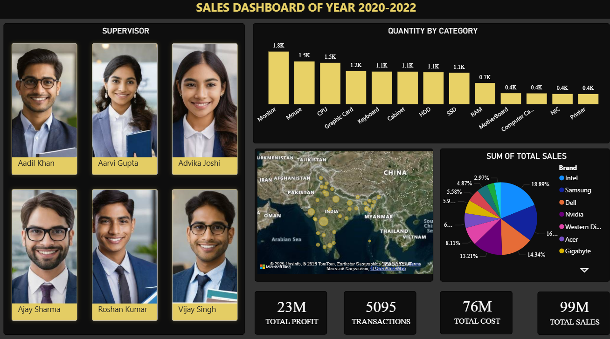

# Sales Dashboard

A Power BI-based sales analytics dashboard for exploring technology sales data across product categories, regions, and time periods.

## Overview

This repository contains a business intelligence dashboard built from a sales dataset in Excel and packaged as a Power BI report. The goal is to provide a clear, visual summary of performance trends and key sales metrics to support business decision-making.

The project is designed for:

- sales trend analysis
- regional performance comparison
- product/category performance review
- quick business reporting without writing custom code

## Repository Contents

- `Sales_Dashboard.pbix` — Power BI report file containing the interactive dashboard
- `Complete_Techno_Sales_Data-2 (1).xlsx` — source sales dataset used by the dashboard
- `Screenshot.png` — preview image of the dashboard

## Dashboard Preview

## Data Source

The dashboard uses the Excel workbook `Complete_Techno_Sales_Data-2 (1).xlsx`, which contains the underlying sales records. The report is designed to visualize trends and summarize sales performance using the data in that file.

## How to Use

1. Open Power BI Desktop.
2. Load the `Sales_Dashboard.pbix` file from this repository.
3. If needed, verify the Excel data source path and refresh the dataset.
4. Explore the visuals to review trends, performance, and sales distribution.

## Requirements

- Microsoft Power BI Desktop
- Access to the Excel source file included in the repository

## Suggested Use Cases

- Reviewing monthly or quarterly sales performance
- Comparing sales across regions or product lines
- Identifying top-performing segments
- Sharing business insights with stakeholders through a visual report
